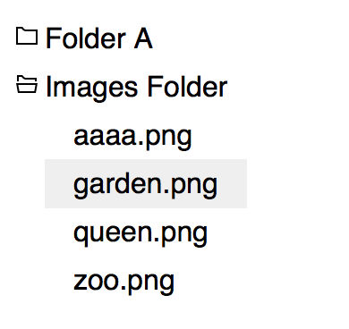

## Customizing checkbox and radio button

**We can customize the style of checkbox and radio button by using the label, `~` adjacent selector and `:checked` pseudo class.** This is by hiding the checkbox/radio and make use of the label to toggle the hidden checkbox/radio.


### Code snippet

HTML

```
<input type='radio' id='desktop-product' name='product' value='desktop'>
<label for='desktop-product'>Desktop</label>
```

CSS

```
input[type='radio'] {
  display: none;
}
input[type='radio'] + label {
  display: block;
  font-size: 1rem;
  padding: 1rem .5rem;
  padding-left: 3rem;
  border: 1px solid transparent;
}
input[type='radio']:checked + label {
  border-color: YELLOWGREEN;
  background: #fdfefb url(https://css3effects.com/tick.png) 10px 50% no-repeat;
}
```

### How it works

```
input[type=checkbox] {
  display: none;
}
input[type=checkbox]~label {
  /* Our normal style here */
}
input[type=checkbox]:checked~label {
  /* Our checked style here */
}
```

### Creating a file list with checkbox and radio

Another example, we can use checkbox and radio to create folder toggling and file selection.



For each folder, their open state is toggled individually. And for file, assuming we allow single file editing, the files will be radio. Otherwise, the files will be checkbox too. 

This technique makes use of the browser behavior so we don’t need to program the toggling ourself. We only need to style them up. 