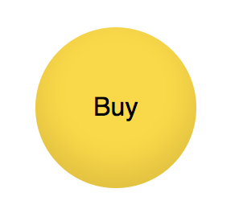
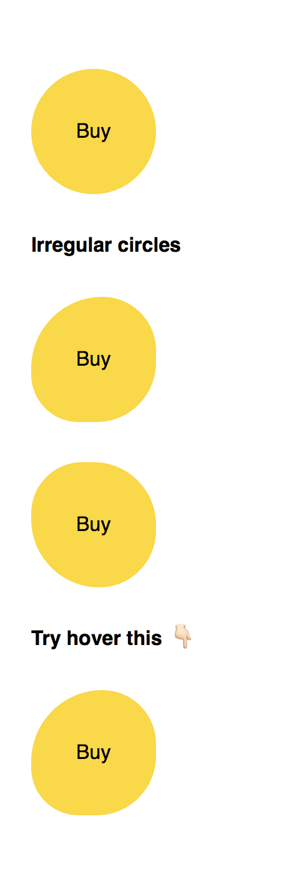

## Drawing circles

**We can draw circles with `border-radius` on an element with same width and height dimension.**

One key point is to make the element a square by setting width and height the same value. The 50% of `border-radius` makes this square a circle.



### Code snippets

```css
.demo {
  width: 100px;
  height: 100px;
  background: gold;
  border-radius: 50%;
}
```


### How it works




The 50% border-radius allows us to draw a full circle.

we can go beyond that, we can slightly adjust the border radius in 4 corners individually to make the circle feels like doodling.

Code example link:

[https://css3effects.com/circle](https://css3effects.com/circle)

```html
<div class="demo">Buy</div>

<strong>Irregular circles</strong>

<div class="demo circle2">Buy</div>
<div class="demo circle3">Buy</div>

<strong>Try hover this 👇🏻</strong>
<div class="demo circle4">Buy</div>
```


CSS

```
.demo {
  width: 100px;
  height: 100px;
  background: gold;
  border-radius: 50%;
  margin: 2em 0;
  line-height: 100px;
  text-align: center;
  cursor: pointer;
}
```


### Irregular Circle

```
.circle2 {
  border-radius: 60% 45% 50% 40%;
}
.circle3 {
  border-radius: 45% 55% 50% 60%;
}

.circle4 {
  border-radius: 60% 45% 50% 40%;
  transition: all .3s ease-out;
}
.circle4:hover {
  border-radius: 50% 55% 45% 60%;  
}
```




### Border image

To further enhance the doodling effect, we can use a dash or dotted borders. Furthermore, we can
