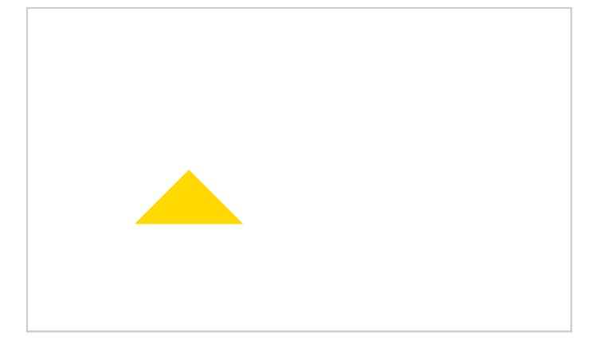
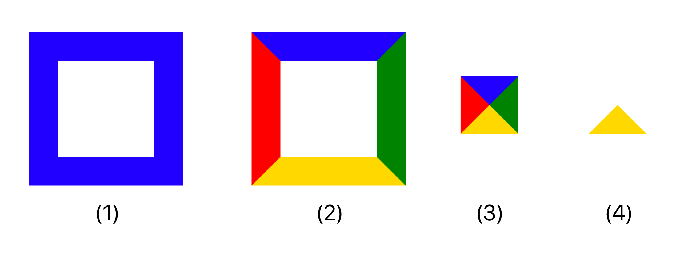
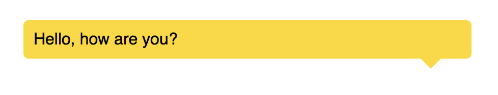

## Drawing triangle

**The triangle is done via `border-color`.**

The size of the triangle depends on the `border-width`. The direction of the triangle depends on which side of the border has color while the others has transparent.

### Code snippets

The follow code snippet creates a triangle.

```
.demo {
  width: 0;
  height: 0;
  border: 30px solid transparent;
  border-bottom-color: gold;
}
```

The following screenshot shows the result:



You can test and modify the code on the following code editor link:

https://css3effects.com/triangle

### How it work

This is a trick on the borders.  We can define different colors for each border.



1. We make a normal element with border.
2. We set different colors to each border.
3. We get rid of the width and height.
4. We make 3 of the borders transparent.

If we want different direction of the triangle, we can simply set different border to be filled and keep the rest of the borders transparent.

You can also find the interactive steps in the following URL:

https://codepen.io/makzan/pen/qYrbvX


### Chat bubble




https://css3effects.com/chat-bubble

```
<div class="chat-bubble">
  Hello, how are you?
</div>
```

CSS

```
.chat-bubble {
  margin-bottom: 10px;
  background: gold;
  padding: 10px;
  position: relative;
  border-radius: 5px;
}
.chat-bubble:after {
  content:'';
  
  position: absolute;
  right: 30px;
  bottom: -20px;
  
  width: 0px;
  height: 0px;
  border: 10px solid transparent;
  border-top-color: gold;
}
```

Please note that the pseudo element must have the `content` to be rendered by browser. So if we don’t need any content, we still need to set the `content:''` to empty.