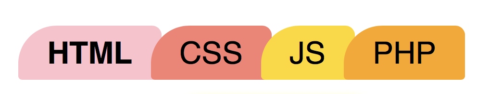

## Creating tab

	.tab-demo li {
	  border-radius: 5px 5px 0 0;
	}

## Creating tabs 2

Border radius

### Code snippet

HTML

	<ul class="tab">
	  <li><a class="active" href="#">HTML</a></li>
	  <li><a href="#">CSS</a></li>
	  <li><a href="#">JS</a></li>
	  <li><a href="#">PHP</a></li>
	</ul>

CSS

	.tab {
	  list-style: none;
	  margin: 0;
	  padding: 0;
	}
	
	ul.tab li {
	  display: inline;
	  margin: 0;
	  margin-left: -10px;
	  background: none;
	}
	ul.tab a {
	  padding: 15px;
	  padding-top: 5px;
	  padding-bottom: 5px;
	  color: black;
	  background: #efefef;
	  text-decoration: none;
	  border-top-left-radius: 20px;
	  border-top-right-radius: 5px;
	  border-bottom-left-radius: 2px;
	  border-bottom-right-radius: 2px;
	/*   display: inline-block;
	  transition: all .3s ease-out; */
	}
	ul.tab a:hover {
	  text-decoration: underline;
	  box-shadow: inset 0 0 25px rgba(0,0,0,0.2);
	}
	ul.tab li:nth-child(1) a {
	  background: pink;
	}
	ul.tab li:nth-child(2) a {
	  background: salmon;
	}
	ul.tab li:nth-child(3) a {
	  background: gold;
	}
	ul.tab li:nth-child(4) a {
	  background: orange;
	}
	ul.tab a.active {
	  font-weight: bold;
	}

### More tabs variants