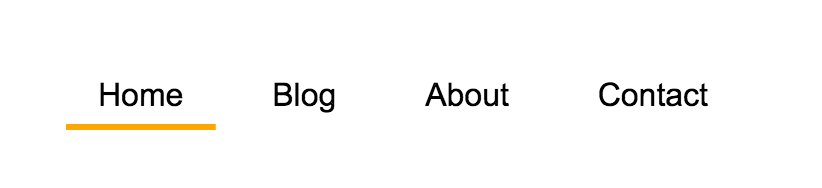

## Animated underline effect

**We can create an animated border by using pseudo-elements to simulate a border.**

### Code snippet

CSS

	.demo {
	  display: inline-block;
	  padding: .5em 1em; 
	  margin-right: .5em;
	  position: relative;
	  color: black;
	  text-decoration: none;
	  overflow: hidden;  
	}
	
	.demo:before {
	  content:'';
	  position: absolute;
	  width: 100%;
	  height: 3px;
	  bottom: 0;
	  left: 0;
	  background: gold;
	  transform: translateX(-100%);
	  transition: all .2s ease-out;
	}
	
	.demo:before {
	  background: orange;  
	}
	
	.demo:hover:before {
	  transform: translateX(0%);
	}

### How it works

https://codepen.io/makzan/pen/LmxVYr

### Let’s animate 2 lines

	*{box-sizing: border-box;}
	.demo {
	  display: inline-block;
	  padding: .5em 1em; 
	  margin-right: .5em;
	  position: relative;
	  color: black;
	  text-decoration: none;
	  overflow: hidden;  
	}
	.demo:after,
	.demo:before {
	  content:'';
	  position: absolute;
	  width: 100%;
	  height: 3px;
	  bottom: 0;
	  left: 0;
	  background: gold;
	  transform: translateX(-100%);
	  transition: all .2s ease-out;
	}
	
	.demo:before {
	  background: orange;  
	}
	.demo:after {
	  transition-duration: .4s;
	  transition-delay: .1s;
	}
	
	.demo:hover:before {
	  transform: translateX(0%);
	}
	.demo:hover:after {
	  transform: translateX(100%);
	}

