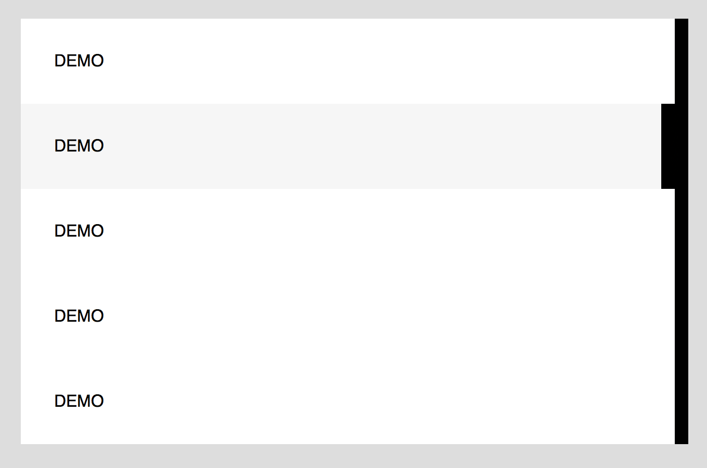

## Drawing lines with linear gradient

Code example link: https://css3effects.com/gradient-lines

### Code snippets

HTML

	

CSS

	.demo {
	  background: linear-gradient(to bottom, gold 50%, orange 50%);
	  background-size: 50px;  
	}
	
	.demo {
	  width: 200px;
	  height: 150px;
	}

### How it works

When two steps of gradients have the same value, the color changes sharply instead of blending. 

### When to use this effect?

This is useful when we need to create a line. This lines may not be equal width. For example, it can be a border on the right or at the bottom. It can also be a diagonal line. 

### Subtle right border hover effects

