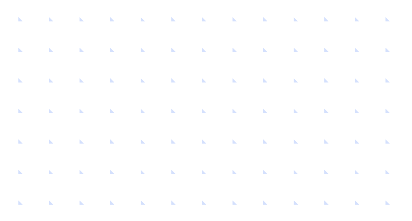
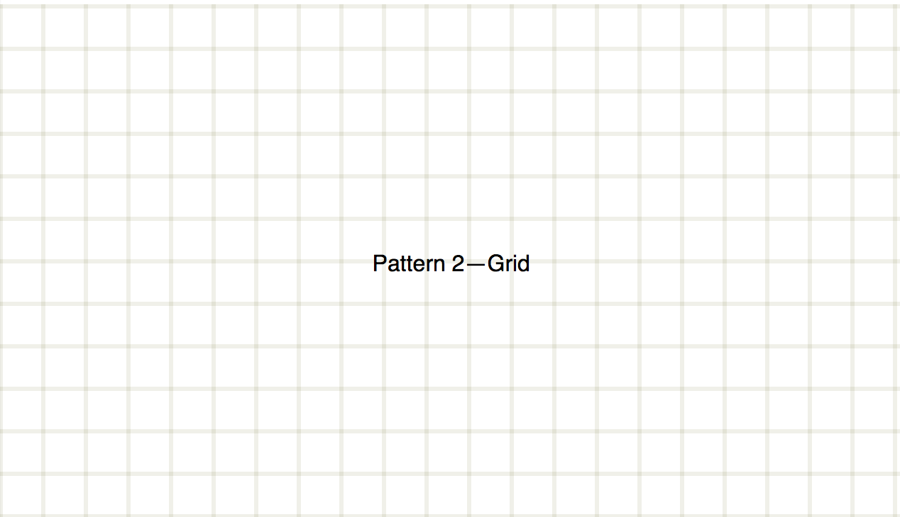
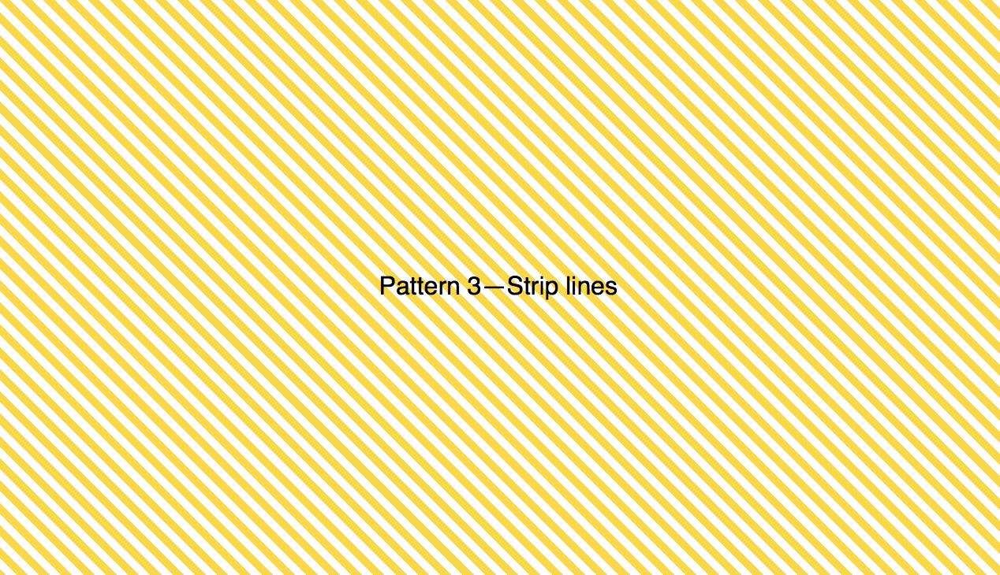

## Drawing repeat patterns with gradient 

**By using `linear-gradient` and `repeating-linear-gradient`, we can create different kind of pattern backgrounds.**


### Code snippet

	.pattern-1 {  
	  background: linear-gradient(45deg, rgba(0,100,255,.2) 3px, transparent 3px);
	  background-size: 30px 30px;
	}

### How it works

The background-size allows us to make the gradient repeat via default background-repeat option.

### More patterns

 

	.pattern-2 {
	  background: linear-gradient(to right, rgba(100,100,0,.1) 3px, transparent 3px),
	    linear-gradient(to bottom, rgba(100,100,0,.1) 3px, transparent 3px);
	  background-size: 30px 30px;
	}

	.pattern-3 {
	  --line-width: 5px;
	  background: repeating-linear-gradient(45deg, gold, gold var(--line-width), transparent var(--line-width), transparent calc( var(--line-width) * 2) );
	}

	.pattern-3b {
	  --line-width: 30px;
	  background: repeating-linear-gradient(-45deg, gold, gold var(--line-width), transparent var(--line-width), transparent calc( var(--line-width) * 2) );
	}

