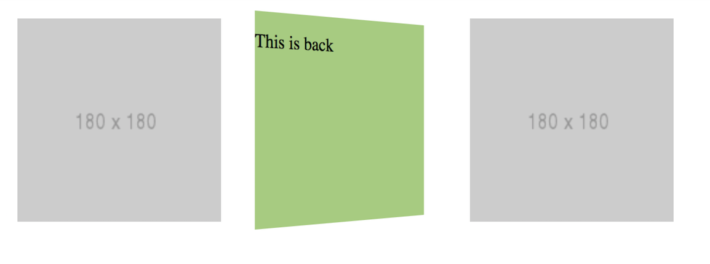
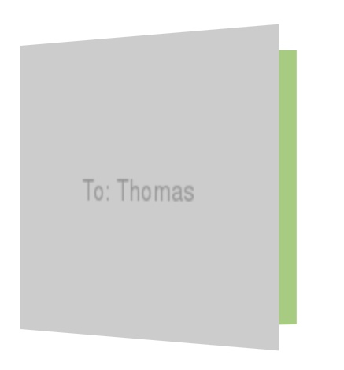
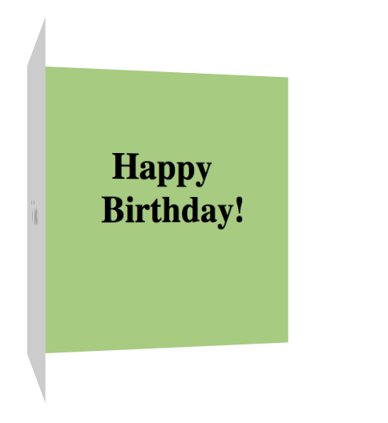

## 3D Card Flipping Effect

**By using `backface-visibility:hidden` and 3D rotation, we can create a card flipping effect.**

This is done by using 2 elements that acts as the `.front.face` and `.back.face`. They are put into a `.card` container.

### Code snippets

https://codepen.io/makzan/pen/vxCdA




### How it works

```html
<div class='card'>
    <div class='front face'>
        
    </div>
    <div class="back face">
        <p>This is back</p>
    </div>
</div>
```

CSS

```css
.card {
    width: 180px;
    height: 180px;
    position: relative;
    perspective: 700px;
    
    float: left;
    margin: 10px;
}
.card:hover .front{
    transform: rotateY(-180deg);  
}
.card:hover .back {
    transform: rotateY(0deg);  
}
.card:hover .face {
    transition: all 0.3s ease-out;
}
.face {
    position: absolute;
    top: 0;
    left: 0;
    width: 100%;
    height: 100%;
    backface-visibility: hidden; 
    transition: all 0.8s ease-out;
}
.front {
    transform: rotateY(0deg);
}
.back {
    background: #9dcc78;
    transform: rotateY(180deg);
}
```


### Greeting card opening



