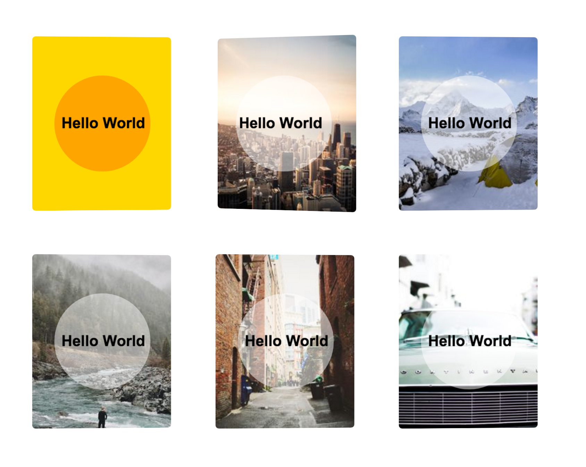
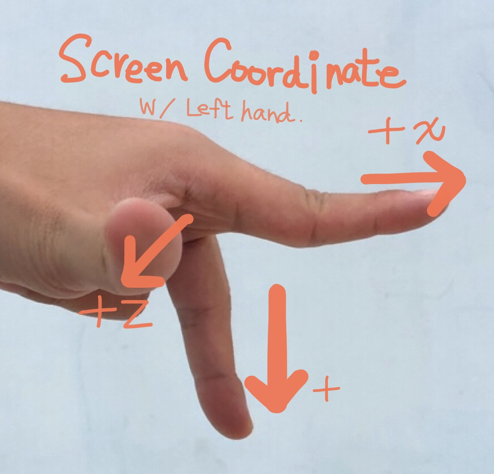

## Parallax 3D Rotation

https://css3effects.com/parallax-card

### Code snippets

HTML

	

	  

	    

	    
Hello World
  
	  

	

CSS

	.demo {
	  width: 200px;
	  height: 250px;
	  
	  float: left;
	  
	  margin: 2em;
	    
	  perspective: 300px;
	}
	.card-content {
	  width: 100%;
	  height: 100%;
	  background: gold;  
	  display: flex;
	  align-items: center;
	  justify-content: center;
	  transform: rotateY(1deg);
	  transition: all 0.3s ease-out;
	  
	  border-radius: 5px;
	  
	  transform-style: preserve-3d;
	}
	.demo:hover .card-content {
	  transform: rotateY(-4deg);
	}
	.bg-object {
	  background: orange;
	  width: 120px;
	  height: 120px;
	  position: absolute;
	  border-radius: 50%;
	  transform: translateZ(40px);
	}
	
	.title {
	  transform: translateZ(80px);
	  font-weight: bold;
	}
	
	/* Photo Card */
	.demo.photo img {
	  position: absolute;
	  width: 100%;
	  height: 100%;
	  object-fit: cover;
	  border-radius: 5px;
	}
	.demo.photo .bg-object {
	  background: rgba(255,255,255,.5);
	}

### How it works

The key to create parallax effect:

1. a container
2. the element to rotate, with preserve-3d
3. the children elements with translate-z

to remember the coordinate, I use left hand like this.

- The index finger is x-axis.
- The middle finger is y-axis.
- The thumb is z-index, pointing out of the screen.

And they all points to the positive direction.
