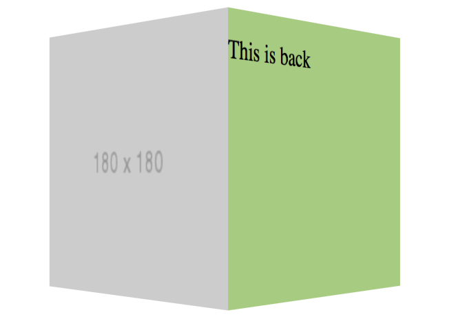
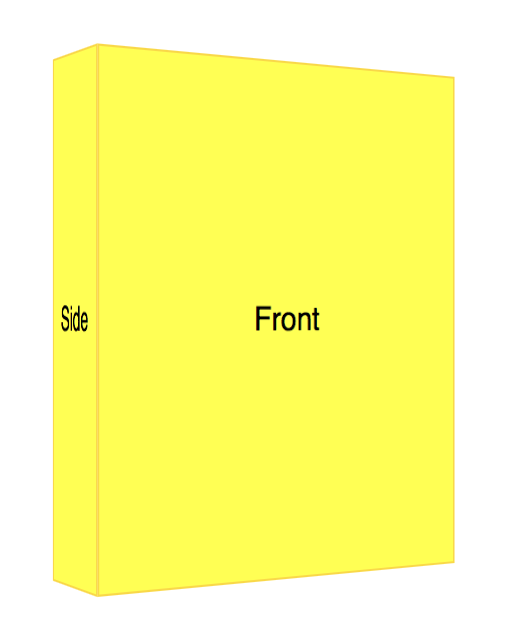

## Cube Rotation

https://css3effects.com/cube

### Code snippets

HTML

	

	    

	        

	            
	        

	        

	            
This is back

	        

	    

	

CSS

	.box-scene {
	    perspective: 700px;
	    width: 400px;
	    height: 200px;
	    margin: auto;
	
	    z-index: 999;
	}
	.box-scene:hover .box {
	    transform: rotateY(-90deg);
	}
	.box {
	    width: 180px;
	    height: 180px;
	    position: relative;
	    
	    transform-style: preserve-3d;
	    
	    transition: all 0.4s ease-out;
	    transform-origin: 90px 90px -90px;
	    
	    /* float: left; */
	    margin: 30px auto;
	    
	    
	}
	
	.face {
	    position: absolute;
	    width: 100%;
	    height: 100%;
	    backface-visibility: visible; 
	    
	    transform-origin: 0 0;
	}
	.front {
	    transform: rotateY(0deg);
	    z-index: 2;
	    background: #d9d9d9;
	}
	.side {
	    background: #9dcc78;
	    transform: rotateY(90deg);
	    z-index: 1;
	    left: 180px;
	}
	
	

### How it works

The preserve 3d setting

3D Book Cover

https://css3effects/book-cover

HTML

	

	  
  
	    
Front

	    
Side
  
	    
Back 

	  

	

CSS

	.scene {
	  perspective: 800px;
	  width: 200px;
	  height: 250px;  
	}
	.cube {  
	  width: 200px;
	  height: 250px;
	  position: relative;
	  
	  transform: rotate3d(0, 1, 0, 0deg);
	  transform-style: preserve-3d;
	  transform-origin: 50% 50% -25px;
	  
	  transition: all 0.3s ease-out;
	}
	.scene:hover .cube {
	  transform: rotate3d(0, 1, 0, 30deg);
	}
	.scene:active .cube {
	  transform: rotate3d(0, 1, 0, 180deg);
	  transition-duration: 0.4s;
	}
	.face {
	  border: 1px solid GOLD;
	  background-color: rgba(255,255,0,1);
	  backface-visibility: hidden;
	  width: 100%;
	  height: 100%;
	  position: absolute;
	  top: 0;
	  left: 0;
	  text-align: center;
	  line-height: 250px;
	}
	.front.face {
	  z-index: 0;
	}
	.side.face {
	  transform: translate3d(-100%, 0, 0) rotate3d(0, 1, 0, -90deg);
	  transform-origin: 100% 50%;
	  z-index: 0;
	  width: 50px;
	}
	.back.face {
	  transform: translate3d(0, 0, -50px) rotate3d(0, 1, 0, 180deg);
	}