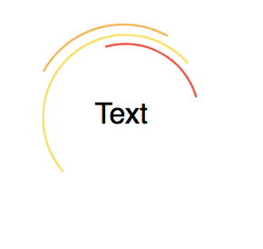
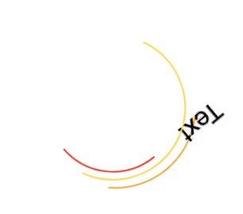

## Circular motion lines

We can use the techniques from Pie drawing to create circular motion lines.

At the end of the section, we will have the following effect created.

### Code snippet

	.demo {
	  border-radius: 50%;
	  border: 1px solid transparent;
	  border-top-color: orange;
	  width: 100px;
	  height: 100px; 
	}

### How it works

### Let’s animate the motion line

	@keyframes keep-rotating {
	  0% { transform: rotateZ(0)}
	  100% {transform: rotateZ(360deg)}
	}
	.demo {
	  border-radius: 50%;
	  border: 1px solid transparent;
	  border-top-color: orange;
	  width: 100px;
	  height: 100px; 
	  animation: 1000ms keep-rotating infinite;
	}

We can put 2 more lines there by using pseudo-elements.

### Let’s animate them all

	@keyframes keep-rotating {
	  0% { transform: rotateZ(0)}
	  100% {transform: rotateZ(360deg)}
	}
	.demo {
	  border-radius: 50%;
	  border: 1px solid transparent;
	  border-top-color: orange;
	  width: 100px;
	  height: 100px; 
	  animation: 1000ms keep-rotating infinite;
	  animation-timing-function: linear;
	  position: relative;
	}
	.demo:after {
	  content: '';
	  position: absolute;
	  width: 80%;
	  height: 80%;
	  left: calc( 50% - 80% / 2);
	  top: calc( 50% - 80% / 2);
	  border: 1px solid transparent;
	  border-top-color: red;
	  border-radius: 50%;
	  transform: rotateZ(45deg)
	}
	.demo:before {
	  content: '';
	  position: absolute;
	  width: 90%;
	  height: 90%;
	  left: calc( 50% - 90% / 2);
	  top: calc( 50% - 90% / 2);
	  border: 1px solid transparent;
	  border-top-color: gold;
	  border-left-color: gold;
	  border-radius: 50%;
	  transform: rotateZ(20deg)
	}

### Wrapper with text

The following won’t work:

	
Text

If we want to put a text at the center of the motion lines, you’ll find the text rotate with the lines as well.

That’s because we are rotating the `.demo` element. The text is inside the `.demo` element.


One simple way is to use a container to wrap both the animated lines and the text together.

	

	  

	  
Text

	

Extra CSS for positioning:

	.demo-container {
	  width: 100px;
	  height: 100px;
	  position: relative;
	  display: flex;
	}
	.demo-container .demo {
	  position: absolute;
	  top: 0;
	  left: 0;
	  width: 100%;
	  height: 100%;
	}
	.demo-container p {
	  margin: auto;
	}

### One element solution

	
Text

The CSS that use pseudo-element to create the motion lines, instead of rotating the element itself.

	.demo2 {
	  display: flex;
	  align-items: center;
	  justify-content: center;
	  border: none;
	  
	  width: 100px;
	  height: 100px; 
	  position: relative;
	}
	
	.text-with-motion-line.two-lines:after,
	.text-with-motion-line:before {
	  content: '';
	  width: 100%;
	  height: 100%;
	  position: absolute;
	  top: 0;
	  left: 0;
	  border-radius: 50%;
	  border: 1px solid transparent;
	  border-top-color: orange;
	  
	  animation: 1000ms keep-rotating infinite;
	  animation-timing-function: linear;
	}
	.text-with-motion-line.two-lines:after {
	  border-top-color: gold;
	  width: 90%;
	  height: 90%;
	  left: calc( 50% - 90% / 2);
	  top: calc( 50% - 90% / 2);
	  animation-delay: 0.15s;
	}

From the example, you can find that we can have variants on the same effect. Sometimes we can create the effect by using one elements and its pseudo elements. Sometimes we may need extra elements and wrapper to achieve the result. Either way, we want to achieve the result effect and make it as elegant as possible, but if we can’t make it elegant, that’s okay to move on with a result with not-so-good HTML structure.
