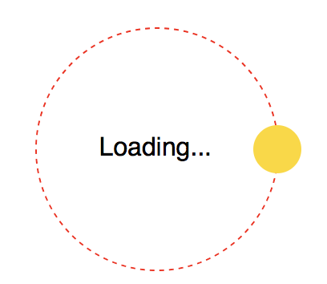

## Circular motions

https://codepen.io/makzan/pen/PeWJdq

### Code snippets

	

	  

	  Text
	

CSS

	.demo {
	  width: 100px;
	  height: 100px;  
	  position: relative;  
	  display: flex;
	  align-items: center;
	  justify-content: center;
	}
	
	.demo .orbit {
	  width: 100%;
	  height: 100%;
	  transition: all .3s ease-out;
	  position: absolute;
	  top: 0;
	  left: 0;
	  border-radius: 50%;
	}
	
	.demo .orbit:after {
	  --size: 20%;
	  content: '';
	  position: absolute;
	  width: var(--size);
	  height: var(--size);
	  top: calc( 50% - var(--size) / 2 );
	  left: calc( -1 * var(--size) / 2 );
	  border-radius: 50%;
	  background: gold;
	}
	
	.demo:hover .orbit {
	  transform: rotateZ(540deg);
	}

### How it works

### Circular loading animation

https://css3effects.com/circular-loading

HTML

	

	  

	  Loading...
	

CSS

	.demo {
	  width: 150px;
	  height: 150px;  
	  position: relative;  
	  display: flex;
	  align-items: center;
	  justify-content: center;
	}
	
	.demo .orbit {
	  width: 100%;
	  height: 100%;
	  transition: all .3s ease-out;
	  position: absolute;
	  top: 0;
	  left: 0;
	  border-radius: 50%;
	}
	
	.demo .orbit:after {
	  --size: 20%;
	  content: '';
	  position: absolute;
	  width: var(--size);
	  height: var(--size);
	  top: calc( 50% - var(--size) / 2 );
	  left: calc( -1 * var(--size) / 2 );
	  border-radius: 50%;
	  background: gold;
	}
	
	.demo:hover .orbit {
	  transform: rotateZ(540deg);
	}
	
	/* Debug Style */
	.debug.demo .orbit {
	  border: 1px dashed red;
	}

